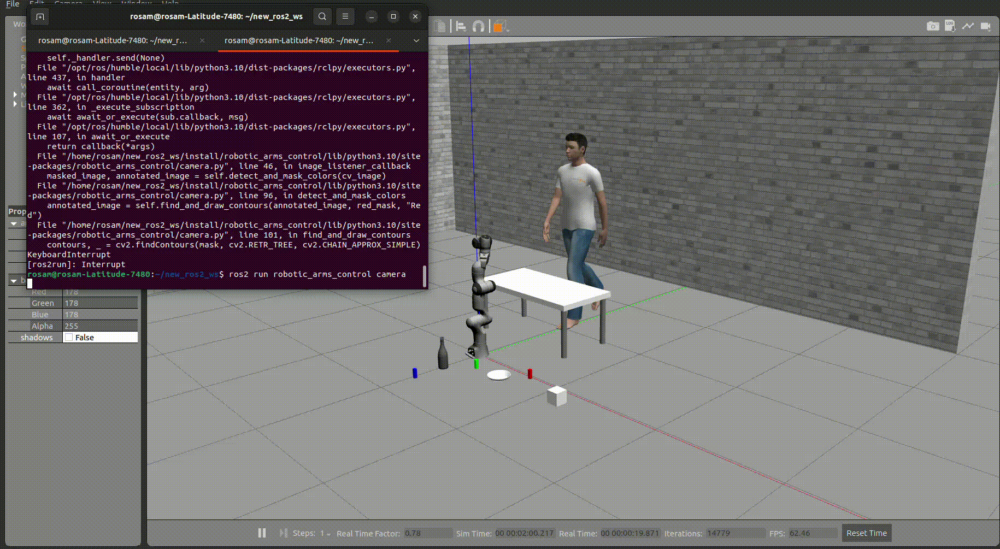
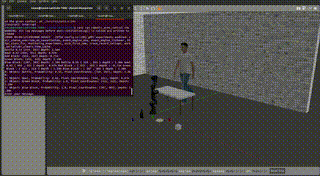

<div style="display: flex; justify-content: space-between;">
  
  
</div>

# GenAI Manipulation

---

**Samik Singh**  
**(https://www.linkedin.com/in/imsamik/)** | **imsamik@gmail.com** | **University of Texas at Austin Robotics**

---

<details>
  <summary>📄 Table of Contents</summary>

  - [About](#about)
  - [Installation](#installation)
  - [Usage](#usage)
  - [Features](#features)
  - [Contributing](#contributing)
  - [License](#license)
  - [Contact](#contact)

</details>

## About

**GenAI Manipulation** is a ROS 2-based project that combines computer vision and generative AI to enable intuitive human-robot interaction. By detecting and classifying objects, the system interprets user requests and determines appropriate robotic actions to assist in various tasks. The goal is to make human-robot interaction effortless by leveraging advanced AI techniques to understand and fulfill user needs.

---
## Installation

All packages in this repository have been developed, executed, and tested on an Ubuntu 22.04 machine with ROS 2 Humble. Follow the steps below to set up your ROS 2 Humble environment and install the necessary robot simulation packages.

### ROS 2 Humble Environment Setup

1. **Install Ubuntu 22.04**: [Download and install Ubuntu 22.04](https://ubuntu.com/desktop).

2. **Install Git**:
    ```bash
    sudo apt update
    sudo apt install git
    ```

3. **Configure Git**:
    ```bash
    git config --global user.name YourUsername
    git config --global user.email YourEmail
    git config --global color.ui true
    git config --global core.editor code --wait # Visual Studio Code is recommended.
    git config --global credential.helper store
    ```

4. **Install ROS 2 Humble**:
    - Follow the installation instructions on the [ROS 2 Humble documentation](https://docs.ros.org/en/humble/Installation.html).

5. **Source ROS 2 Humble Installation**:
    Add the following line to your `.bashrc` file:
    ```bash
    source /opt/ros/humble/setup.bash
    ```

6. **Install MoveIt! 2 for ROS 2 Humble**:
    - Reference: [MoveIt! 2 Humble Documentation](https://moveit.ros.org/documentation/).
    - Install MoveIt! 2 binaries:
      ```bash
      sudo apt install ros-humble-moveit
      ```

7. **Create and Configure the ROS 2 Humble Workspace**:
    - Follow the instructions in the [ROS 2 Humble Workspace Documentation](https://docs.ros.org/en/humble/Creating-A-Workspace.html).
    - Add the following line to your `.bashrc` file to source the workspace:
      ```bash
      source ~/dev_ws/install/local_setup.bash
      ```

8. **Install ROS 2 Packages Required for Robot Simulation and Control**:
    - ROS 2 Control:
      ```bash
      sudo apt install ros-humble-ros2-control
      ```
    - ROS 2 Controllers:
      ```bash
      sudo apt install ros-humble-ros2-controllers
      sudo apt install ros-humble-gripper-controllers
      ```
    - Gazebo-ROS 2:
      ```bash
      sudo apt install gazebo11
      sudo apt install ros-humble-gazebo-ros2-control
      sudo apt install ros-humble-gazebo-ros-pkgs
      ```
    - Xacro:
      ```bash
      sudo apt install ros-humble-xacro
      ```

9. **Import and Install the `ros2_RobotSimulation` Repository**:
    This repository is required to run the ROS 2 packages for robot simulation.
    - Clone and build the repository:
      ```bash
      cd ~/dev_ws/src
      git clone 
      cd ~/dev_ws
      colcon build
      ```

10. **Additional Installations**:

    - **YOLOv8**:
      YOLOv8 is a state-of-the-art object detection model. 
      - **Install YOLOv8 dependencies**:
        ```bash
        pip install torch torchvision torchaudio
        pip install yolov8
        ```

    - **Google Vision Cloud API**:
      Google Vision Cloud API is used for image analysis. It is used to extract labeled text from images
      - **Install Google Cloud Vision client library**:
        ```bash
        pip install google-cloud-vision
        ```
      - **Obtain API Key**:
        1. Create a Google Cloud Project and enable the Vision API.
        2. Set up billing and create credentials.
        3. Download the JSON key file and set the environment variable:
           ```bash
           export GOOGLE_APPLICATION_CREDENTIALS="/path/to/your/keyfile.json"
           ```

    - **OpenAI GPT Model**:
      OpenAI’s GPT model is used for text-based AI tasks. It is used to identify which actions will be most suitable based on the users request.
      - **Install OpenAI Python client**:
        ```bash
        pip install openai
        ```
      - **Obtain API Key**:
        1. Sign up for OpenAI and generate an API key from the [OpenAI API Keys page](https://platform.openai.com/account/api-keys).
        2. Set up your API key in your environment:
           ```bash
           export OPENAI_API_KEY="your-api-key"
           ```

    - **Robotics Toolbox for Forward and Inverse Kinematics**:
      For kinematic computations.
      - **Install Robotics Toolbox**:
        ```bash
        pip install roboticstoolbox
        ```

---

## Usage

To get started with the ROS 2 simulation and control of your Panda robot, follow these steps:

1. **Source Your Workspace**:
   Every time you open a new terminal, make sure to source your workspace setup file:
   ```bash
   source ~/dev_ws/install/local_setup.bash

---
## Features

### Vision Capabilities

This project integrates advanced computer vision tools to enhance object detection and spatial understanding. The vision capabilities are essential for accurate object identification and position mapping in real-world scenarios. Below are the key vision components:

1. **YOLOv8 Object Detection**  
   YOLOv8 is a state-of-the-art object detection model that enables high-accuracy detection and classification of objects in images. We use this identify and annotate images with a comprehensive
   image of all of the objects detected in a workspace

   **Command to run YOLOv8 object detection:**  
   ```bash
   
   ros2 run robotic_arms_control camera

2. **Sensors**                                                                                                                                                                              
   We use a rgb camera and a depth camera to identify the distance the camera is from certain objects. Using computer vision based technqiues we can then identify where the objects are in x,y,z
   coordinates
   ```bash
   
   ros2 run robotic_arms_control camera_depth x y
   ```
   


3. **Google Vision Cloud API**                                                                                                                                                                                                                        Google Vision Cloud API allows us to parse text from our annotated images that are taken as a livestream from our camera. Using the information provided we can then feed information into OpenAI in order to deduce which objects should be manipulated and what actions should be taken with them. Each object is given a probability, its (u,v) camera-based coordinates and its distance from our camera.                                                                                                                                                                       
   
   ```bash
    
   python3 cloudvision_tester.py
   ```
   
   

### Motion Planning

This project employs a variety of different techniques to ensure our robot is properly pathing to objects in a manner which will ensure proper manipulation practices:

1. **Rviz Based Joint Configuration**  
   MoveIt2 comes with a ROS2 interace in which the user is given the ability to control individual robot joint values in 
   order to visualize what what the robot configuration looks like. Use this as a means to get familiar with Panda Robot's   
   movement as well as gain an a base understanding for which joint values you should use to achieve your desired end- 
   effector position
   

   **Command to run Rviz joint visualization:**  
   ```bash
   
   ros2 launch robotic_arms_control rviz_bringup.launch.py

   ```
   


2. **User Robot Teleoperation**                                                                                                                                                                              
   As an initial approach to robot teleoperation, I have developed a basic interface that enables the user to incrementally 
   adjust the x,y,z position of the end-effector. While this interface is functional, it may feel somewhat 
   unintuitive. I recommend experimenting with the Rviz-based joint configuration tool described above, as it provides a more 
   user-friendly and visual way to understand and manipulate the robot's joints.
   
   coordinates
   ```bash
   
   ros2 run robotic_arms_control teleop
   ```

   
   


3. **Inverse Kinematic Solver**

   This inverse kinematic solver plays a crucial part in our final product. The Robotics Toolbox library provides some helpful documentation for creating inverse-kinematic solvers that can find the proper joint configurations to achieve x,y,z end-effector poses. I modified the code to ensure that our end-effector remains pointed down throughout the pathing to ensure it could grip objects in proper fashion. With this code the user can specify real-world x,y,z coordinates and an action such as "rearrange" that outlines what the robot does once it achieves a specific position.                                        
   
   ```bash
    
   ros2 run robotic_arms_control xyzsolver {x y z action}
   ```
---
## Final Product

### VisiontoOpenAI1, VisiontoOpenAI2

This code integrates Google Cloud Vision, OpenAI's GPT-4, and ROS 2 to detect objects in an image, extract relevant information, and control a robotic arm based on user input. The users input could be any simple phrase such as "I want to make some cereal". This robot will then be able to survey the available objects and identify which action to grasp and which corresponding action to complete in order to best fulfill the user's need. VisiontoOpenAI1 takes an annotated input image which is created by taking a snapshot of the live camera feed utlizing Yolov8 object detection. It then uses Google Vision's cloud API to extract information from the image such as the camera (u,v) coordinates of the identified object, the depth, and the name of the object itself. This information is then handed off to OpenAI to determine which of the provided objects best suits the user's needs as well as which action best suits the user's needs. VisiontoOpenAI1 also uses OpenAI to calculate the real-world coordinates of the object through AI-prompting whereas VisiontoOpenAI2 uses computer vision techniques.

1. **OpenAI GPT-4 Integration**  
   YOLOv8 is a state-of-the-art object detection model that enables high-accuracy detection and classification of objects in images. We use this identify and annotate images with a comprehensive
   image of all of the objects detected in a workspace

   **Object Selection**  
   The user provides a message describing their intent (e.g., "I want to pick up the red block"). GPT-4 is used to determine the most suitable object based on this input by selecting from the         detected objects.

   **World-Coordinate Calculation**  
   Once an object is selected, GPT-4 calculates the world coordinates of the object based on the camera's intrinsics, pose, and the object's pixel coordinates and depth. It uses a specific logic      (e.g., subtracting the depth from the camera's x-position) to derive the coordinates, ensuring accurate control of the robotic arm.

   ```bash
   ros2 run robotic_arms_control v2a
   ros2 run robotic_arms_control v1a
   ```
 2. **Hand-Off to xyz-solver interface**
    
    This ROS 2 Python script controls a Panda robotic arm to perform pick-and-place tasks based on provided XYZ coordinates, object name, and action ('table' or 'rearrange'). This is called to complete the motion planning handoff to complete VisiontoOpenAI program execution.
    
    1. Initializes ROS 2 Node: Sets up a node that can publish joint trajectories to the robot arm.

    2. Parses Input Arguments: Takes command-line arguments for XYZ coordinates, the object to interact with, and the desired action.
    
    3. Determines Goal Positions: Calculates joint positions (q_pickup1, q_pickup2) based on the XYZ input and generates a list of goal positions for the action sequence (either 'table' or   'rearrange').

    4. Publishes Trajectories: Publishes the robot arm's joint trajectories to reach the specified goals. It also attaches or detaches the specified object using ROS services.

    5. Teleoperation Mode: Allows manual adjustments of the arm's XYZ position using the keyboard during the execution of the trajectory.

    6. Attach/Detach Object: Uses service calls to attach or detach the specified object to/from the robot's gripper.

   **Final Product**: "The man near the table is thirsty" as our example input, the code then identifes the best course of action to be picking up the bottle and placing it on the table.
   
   

   


   

### Acknowledgements

IFRA (2022) ROS2.0 ROBOT SIMULATION. URL: https://github.com/IFRA-Cranfield/ros2_RobotSimulation

noshluk2: https://github.com/noshluk2/ROS2-Ultimate-guide-for-Custom-Robotic-Arms-and-Panda-7-DOF/tree/master

PicNik Robotics - MoveIt!2 Documentation

Panda Robot - ROS Repository

ROS2.0 Documentation - Humble

Robotics Toolbox Python - https://github.com/petercorke/robotics-toolbox-python
   

   
### Contributing

Contributions are the heartbeat of the open-source community, fueling creativity, learning, and inspiration. Your contributions, no matter how big or small, are highly valued. If you have suggestions for improvements or solutions to any of the issues listed above, feel free to fork the repository and submit a pull request. Alternatively, you can open an issue and tag it as an "enhancement." And if you find this project helpful, don't forget to give it a star! Thank you so much for your support!

### License

Created on behalf of Samik Singh, The University of Texas at Austin
E-mail: imsamik@gmail.com

Licensed under the Apache-2.0 License.

### Contact

**Samik Singh**  
**imsamik@gmail.com**  
**https://www.linkedin.com/in/imsamik/**

